<header>

# FSA_Assistant 使用帮助教程

FSA_Assistant 是一个上位机软件，它集成了全面的监视、控制、数据分析及软件升级功能于一体。你可以通过 FSA_Assistant 来对执行器进行查看信息，控制运动，监控数据，升级版本等功能。其主要分为一个导航栏和四个子页面。

</header>

## 目录
[导航栏](#导航栏)  
[信息页面](#信息页面)  
[运动页面](#运动页面)  
[监控页面](#监控页面)  
[串联界面](#串联界面)  
[常用功能使用教程](#常用功能使用教程)  
[ubuntu中开始网络共享教程](#ubuntu中开始网络共享教程)  
[V0.0.1.3更新功能点](#v0013更新功能点)  
[V0.0.1.7更新功能点](#v0017更新功能点)  
[V0.0.1.16更新功能点](#v00116更新功能点)  
## 导航栏
导航栏主要实现对执行器的查找和选中以及页面之间的切换功能。

**导航栏上半部分**，主要实现页面切换功能。导航栏中的“信息”、“运动”、“监控”、“串联”为四个不同的按钮，当**单击**按钮时右侧空白区域会显示为对应的子界面，当**双击**按钮时，会将对应子界面单独显示在一个独立窗口中。（右侧空白区域默认显示信息页面）

**导航栏下半部分**，主要对执行器进行显示、查找、清除等功能。导航栏中的“广播设置”、“清除”、“搜索”、“筛选”为四个不同的按钮。搜索按钮按下后，将会检索所有连接的执行器，并将他们显示在下面的空白区域。清除按钮按下后，会将下面检索到的所有执行器全部删除。在按下检索到的任意一个执行器时会将该执行器选项变亮，即为选中状态（选中状态在各子页面中使用）。  

   
  <em>设备被选中状态字</em>

   
  <em>设备未被选中状态</em>

## 信息页面
信息页面主要对选中状态的执行器的信息进行显示。

监控界面主要分为八部分，其中  
- 区域1，为**重启区域**，其中的重启设备按钮，可以将选中的执行器重启。另一个重启按钮，可以将该软件重启（快捷键Ctrl+R同样可以重启软件）。 
- 区域2，为**升级区域**，可以对选中的执行器进行通讯和驱动的升级。（具体升级步骤请点击[常用功能使用教程](#常用功能使用教程)  ）
- 区域3，为**设备信息区域**，主要显示选中执行器的执行器信息，以及报错信息。
- 区域4，为**标识区域**。
- 区域5，为 pid 区域，可以对选中的执行器的 pid 参数进行获取和设置。
- 区域6，为**网络区域**，可以对选中的执行器的网络参数进行获取和设置。
- 区域7，为**执行器配置区域**，可以对选中的执行器配置参数进行获取和设置。
- 区域8，为**调试信息显示区域**，当勾选启动 udp log 之后会将之前串口显示的调试信息显示在该区域。
## 运动页面
运动界面主要对选中的执行器进行速度、位置、电流的设置，以及让执行器按照指定的波形进行转动和观察单个执行器的波形数据。

监控界面主要分为三部分，其中
- 区域1，为**电机参数设置区域**，这里可以选择观察选中电机的位置、速度、电流、力矩、温度这五个参数进行观察，勾选后会在区域 3 中显示出来。还可以设置电机的使能失能以及校准功能。当按下重置图表之后，会将区域 3 的所有图表都清空，即按下按钮之前的数据不会再显示。还可以设置 pid imm的相关参数（pid imm配置后立即生效但不会保存，重启执行器后参数恢复）
- 区域2，为**波形的生成区域**，主要分为两模式，一个是简单模式，可以直接设置固定的位置、速度、和电流。另一个是高级模式，可以生成各种波形（正弦、方波、三角波、锯齿波、梯形波、线性变频正弦、时间变频正弦、周期变频正弦），并将这些波形按照位置或者速度或者电流发给执行器去执行。

   
  <em>简单模式的显示</em>

   
  <em>复杂模式的显示</em>

波形输入参数说明：  

| 参数名称        | 参数含义    |
| --------    | -----   |
| 开始时间        | 当相对时间未勾选时，为绝对时间，参考区域 3 中坐标系的 x 轴填写，当相对时间勾选后，表示从生成波形按钮按下后的多长时间开始。|
| 振幅        | 为波形的最大值 |
| 相位        | 为波形的相位 |
| 偏置        | 为竖直方向的偏置，为正时，会让波形整个往上偏移 |
| 频率        | 为波形的频率 |
| 时间        | 为波形需要生成的时间，单位为秒 |
| 初始频率        | 在生成线性变频正弦、时间变频正弦、周期变频正弦时需要的参数，为开始的频率 |
| 结束频率        | 在生成线性变频正弦、时间变频正弦、周期变频正弦时需要的参数，为结束时频率 |
| 变频幅度        | 在生成时间变频正弦、周期变频正弦时需要的参数，为每次变化频率的变化量 |
| 变频时间        | 在生成时间变频正弦时需要的参数，为每个多长时间会变化一次频率，单位为秒 |
| 变频周期        | 在生成周期变频正弦时需要的参数，为每隔几个周期会变化一次频率。 |

-区域3，为**波形显示区域**，最多可以同时显示选中执行器的位置、速度、电流、力矩、温度五个参数。
## 监控页面
监控界面主要对检索到的所有执行器选择需要的数据（位置、速度、电流、设置位置、设置速度、设置电流、力矩、mos 温度、绕组温度）进行监控。

监控界面主要分为三部分，其中
- 区域1，为**工具栏**，里面有众多查看波形的功能。当勾选 y 轴自动缩放后，下面的时域图中的 y 轴的范围为当前显示区域的最大到最小。当勾选 x 轴实时滚动后，x 轴始终显示最新的数据。当勾选频域图后，会在区域 2 中显示出频域图以及频域信息。点击拖动按钮后，用鼠标拖动下面的时域图或频域图即可查看想要查看的数据。点击框选放大后，用鼠标点击拖动下面的时域图或频域图，即可将对应的坐标系放大到鼠标框选的区域。点击添加后会在区域 3 中添加一条波形数据。点击删除后，会将区域三中被选中的波形数据删除，同时也不会再区域 2 中显示,可以按住ctrl去选中，可以删除多条波形。开启游标后，将鼠标滑动到时域图中，会在鼠标当前位置显示出鼠标当前的 x、y 轴数据，同时在区域 3 中的 value 一列中显示该条波形对应鼠标 x 轴的 y 轴数据。
- 区域2，为**波形的显示区域**。用于显示时域图和频域图，频域图当区域 1 中的频域图被勾选后才会有。频域图显示的频域信息为在时域图范围的对应频域信息，即时域图与频域图是对应的关系。在区域 2 中的时域图点击鼠标右键，会弹出一个菜单，可以自动调节范围一次。
- 区域3，为**波形数据的设置以及显示区域**。当添加一条波形后并不会立刻在区域 2 中显示，需要选择设备以及设备属性。其中设备为检索到的所有执行器的 IP，设备属性为执行器的位置、速度、电流、设置位置、设置速度、设置电流、力矩、mos 温度、绕组温度。选择需要观测的属性即可。其他的波形数据均有默认值可以不设置。  

波形数据可以设置的参数说明：
| 参数名称        | 参数含义    |
| --------    | -----   |
| 时域        | 可编辑属性，选中该选项后会在区域 2 中的时域图中显示该条波形的时域信息。如果不需要观察该波形取消勾选即可|
| 频域        | 可编辑属性，选中该选项后会在区域 2 中的频域图中显示该条波形的频域信息。如果不需要观察该波形取消勾选即可 |
| 名字        | 不可编辑属性，该条波形的名字，由设备以及设备属性共同决定。 |
| 设备        | 可编辑属性，该条波形的执行器 IP |
| 设备属性        | 可编辑属性，该条波形的观察的执行器属性（位置、速度、电流、设置位置、设置速度、设置电流、力矩、mos 温度、绕组温度） |
| 颜色        | 可编辑属性，用于选择该条波形的颜色。默认颜色为随机。 |
| 点类型        | 可编辑属性，有无、单点、十字、圆形、星形、三角形、正方形、菱形、倒三角形可选 |
| 线条类型        | 可编辑属性，有直线、左侧步长、右侧步长、中间步长、脉冲可选 |
| 缩小比例        | 可编辑属性，会将当前的 y 轴数据按照输入的比例进行缩小，用于多条波形同时观察并且 y 轴数据差距较大的情况下。 |
| 竖直偏置        | 可编辑属性，会将当前的 y 轴数据加上输入的偏置之后在显示出来。 |
| value        | 不可编辑属性，当游标功能未开启的情况下，显示最新的 y 轴数据，当游标开启后，显示鼠标当前 x 轴位置的波形的 y 轴数据。 |
| 最大值        | 不可编辑属性，该条波形的最大值 |
| 最小值        | 不可编辑属性，该条波形的最小值 |
## 串联界面
串联界面主要人形机器人、机械狗、半人马中的所有或部分的者执行器进行升级或者速度的设置。

串联界面主要分为四个区域，其中：
- 区域1，为**机器人类别选择区域**，主要用于选择人形机器人、机械狗、半人马，人形机器人中又分为 T1/T2、T4 两种不同的类型，鼠标点击对应区域即可选中对应的类别，选中后会在区域 2 中显示该类别的机器人中的所有执行器 IP。
- 区域2，为**机器人 IP 选择区域**，勾选对应 IP 前的方框即可将该 IP 设置为选中状态（选中状态在区域 3、4 中使用），将对应区域的第一个方框勾选，即可快速勾选该区域的所有 IP，例如当勾选左臂左侧的方框时将会选中 IP 为 192.168.137.10-192.168.137.17 的所有 IP。
- 区域3，为**升级区域**，可用于对区域 2 中所有选中的 IP 的执行器进行通讯或者驱动的升级，其中生产版、测试版、开发版、云端为四个不同的版本，如无所需版本，也可以在自定义版本号一栏中输入所需版本号，然后点击自定义升级即可升级为输入的版本号。（注意，自定义版本号暂无输入错误的检测，请自行检查输入版本是否正确）
- 区域4，为**运动控制区域**，可对多个执行器进行速度的设置。在 Velocity(度/秒)右侧的横线上输入要设置的速度(建议在设置速度前点击失能按钮，可防止选中电机突然转动)，然后点击使能按钮即可使选中电机转动，点击失能按钮即使选中电机停转，当不使用该功能时，建议将速度设置为 0。

## 常用功能使用教程
 - 单个执行器升级：   
  升级前请确保**将需要升级的执行器的网关修改为当前电脑有线网卡的ip**。  
  - 修改执行器的网关教程如下：
  搜索（查找所有执行器）->选中需要升级的执行器->切换到信息页面->修改网关->点击设置->点击获            取并查看当前网关是否被修改成功->点击重启设备（使修改的网关生效）。
    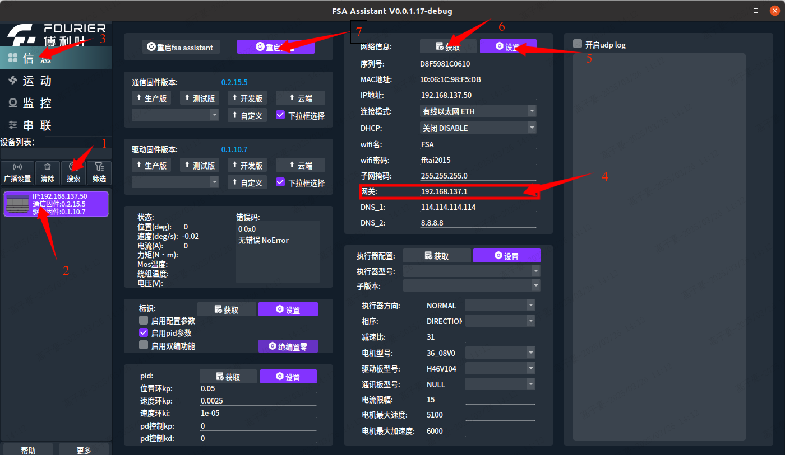
  
  确保先升级通信固件，再升级驱动固件！确保Ubuntu/Windows可以访问互联网且已开启网络共享！
  搜索（查找所有执行器）->选中需要升级的执行器->切换到信息页面->升级通信(选择生产版、测试版、开发版、云端中的一个或者自定义版本)->升级驱动(选择生产版、测试版、开发版、云端中的一个或者自定义版本)->升级成功。
  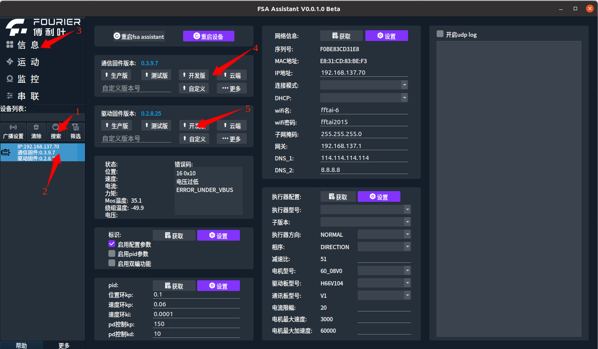

  - 多个执行器升级：    
  升级前请确保将**需要升级的执行器的网关修改为当前电脑有线网卡的ip**。
- 修改执行器的网关教程如下：  
  搜索（查找所有执行器）->选中需要升级的执行器->切换到信息页面->修改网关->点击设置->点击获            取并查看当前网关是否被修改成功->点击重启设备（使修改的网关生效）。
    
  
  确保先升级通信固件，再升级驱动固件！确保Ubuntu/Windows可以访问互联网且已开启网络共享！
  搜索（查找所有执行器）->切换到串联页面->选择所需的机器人类别->选择需要升级的执行器->升级通信(选择生产版、测试版、开发版、云端中的一个或者自定义版本)->升级驱动(选择生产版、测试版、开发版、云端中的一个或者自定义版本)->升级成功。
  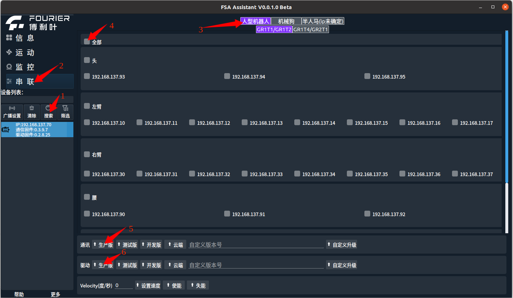

 - 查看单个执行器的波形数据：     
  搜索（查找所有执行器）->切换到监控页面->在设备列表中选择需要的执行器->选择要观察的属性->开始观察。  
  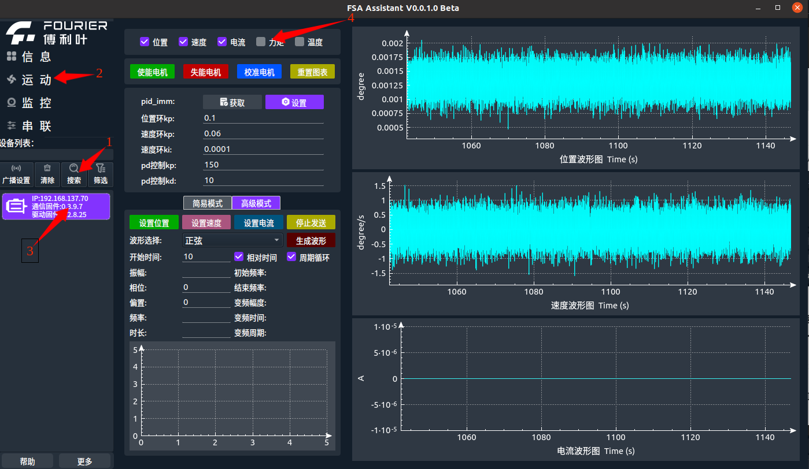

- 查看多个执行器波形数据：  
  搜索（查找所有执行器）->切换到运动页面->点击添加按钮->选择设备->选择设备属性->继续点击添加按钮直到添加完需要添加的波形->观察波形（如果需要观察频视图，勾选频视图即可）。 
  

- 查看多个执行器波形数据中调整观测范围  
  前期步骤与查看多个执行器波形数据步骤一致，添加波形后->取消x轴实时滚动->取消y轴自动缩放->点击拖动->鼠标在时域图或者频域图中按住并拖动调整观测范围（或者使用鼠标滚轮缩放观测范围），
  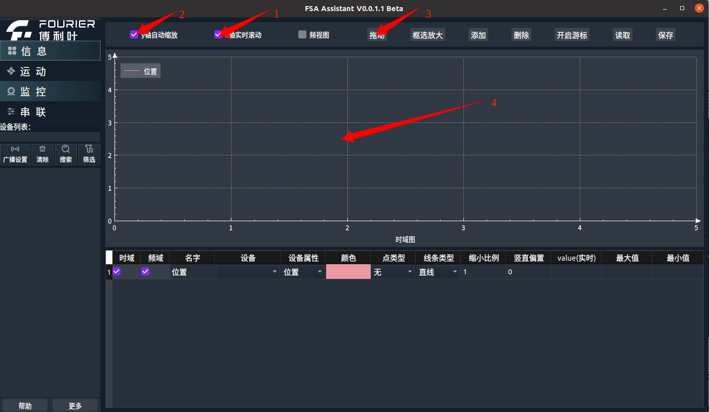  

- 调整监控界面中的表格的大小。  
  将鼠标放到表头和第一行之间（建议不要在设备、设备属性、颜色、点类型、线条类型这一列中，容易误触），出现上下标志的箭头即为成功->鼠标按住往上拖动即可使表格变大，往下拖动即可使表格变小。
  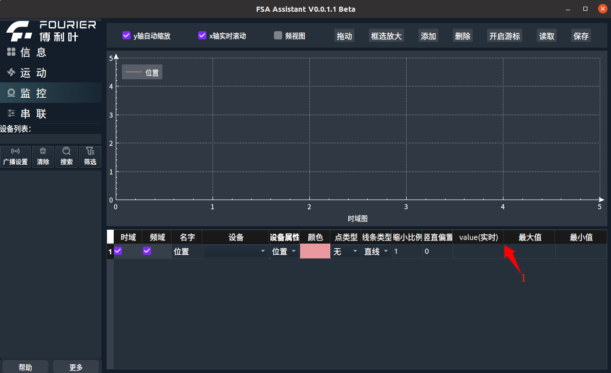

- 监控界面中删除部分波形。  
  使用鼠标点击需要删除的那一行中的缩小比例或者竖直偏置（如果需要删除多个波形可以使用crtl加鼠标点击）（如果需要全部删除请点击缩小比例或者竖直偏置的表头即可全部选中）->点击删除，即可将选中的波形删除。
  

- 监控界面中游标功能的使用。  
  

- 设置单个执行器的执行复杂波形：。  
  搜索（查找所有执行器）->切换到运动页面->在设备列表中选择需要的执行器->点击高级模式->选择需要的波形->设置所需的波形数据->点击生成波形->按需求点击设置速度、设置位置、设置电流三个按钮里面的一个->电机开始转动->需要停转的时候点击停止发送按钮。
  

- 设置多个执行器的速度：。  
  搜索（查找所有执行器）->切换到串联页面->选择所需的机器人类别->选择需要升级的执行器->点击失能按钮（防止电机突然动）->输入速度->点击设置速度按钮->点击使能按钮->电机开始转动->需要停转的时候点击失能按钮。
  

## ubuntu中开始网络共享教程
### 第一次使用
需要配置本机网络允许转发。
1. 打开终端（在桌面上点击鼠标右键，点击在终端中打开（E））
2. 输入 sudo gedit /etc/sysctl.conf 之后输入密码（输入密码过程中不会显示输入的密码）
3. 在里面找到 net.ipv4.ip_forward=1 将其前面的#删除或者在最后一行添加 net.ipv4.ip_forward=1 之后关掉这个页面
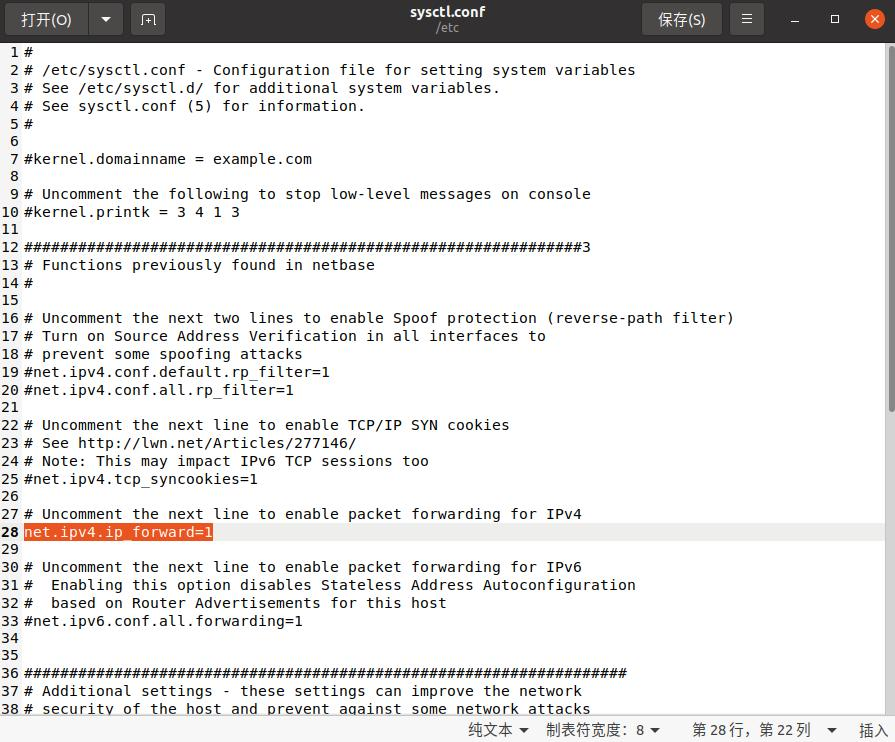
4. 在从终端中输入 ifconfig。
5. 从显示的信息中找到能上网的网卡 name 并记住他。
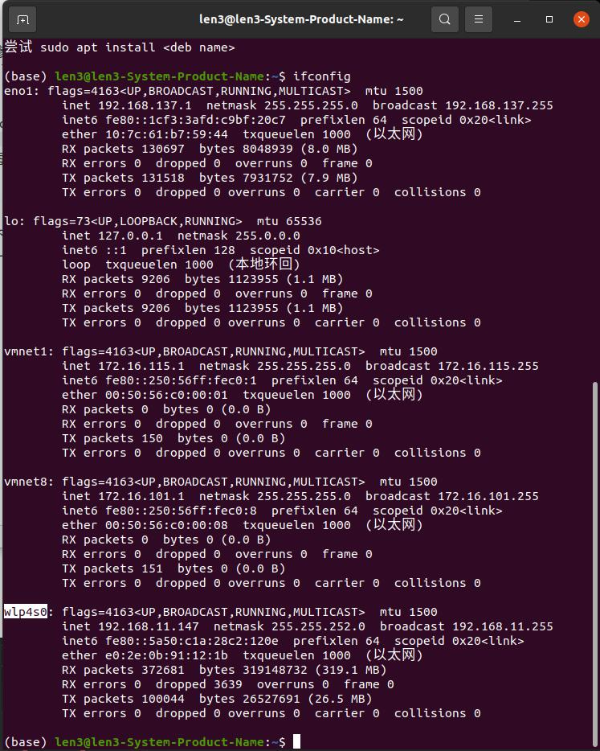
6. 找到脚本所在目录并打开它：在 FSA_Assistant 软件所在目录下找到一个 network_sharing_ubuntu.sh 脚本，点击鼠标右键，点击用文本编辑器打开。
7. 将里面第 3 行的 wlp4s0 替换为你自己的可以上网的无线网卡即可(无线网卡一般是wl开头)。
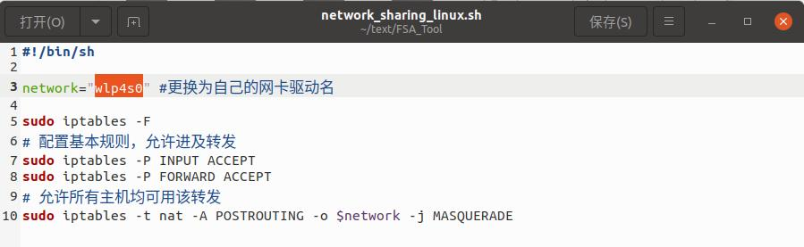
### 日常使用
1. 找到脚本所在目录：在 FSA_Assistant 软件所在目录下找到一个 network_sharing_ubuntu.sh 脚本，
2. 打开终端：在这一级目录下点击鼠标右键，点击在终端中打开（E）
3. 在终端中输入 
sudo chmod 777 ./network_sharing_ubuntu.sh
4. 在终端中输入 ./network_sharing_ubuntu.sh
### 报错修改
如出现sudo: unable to execute ./network_sharing_ubuntu.sh: No such file or directory。的报错  
原因可能为：脚本文件使用了 Windows 的换行符 (CRLF)，而不是 Unix/Linux 的换行符 (LF)。
解决办法为：vim network_sharing_ubuntu.sh      :set fileformat=unix     :wq
操作后需要将sudo iptables -P F 修改为sudo iptables -P FORWARD ACCEPT
## V0.0.1.3更新功能点
1. 新增导航栏按键高亮  
当前页面显示时对应的导航栏会高亮显示。并且双击可以导航栏可以同时显示多个导航栏的内容。  
  
2. 新增运动界面图表详细信息  
在运动界面的中间部分会显示当前波形图的最新的实际值，目标值数据，以及当前所有数据的平均值、最大值和最小值。  
  
3. 新增运动界面图表自动游标功能  
将鼠标放置到运动界面的波形图中，会显示当前鼠标位置的该条数据接收到的系统时间和相对于启动程序的相对时间，以及当前时间的接收到的实际值和发送的目标值。  
4. 新增运动界面图表图片导出pdf功能  
点击导出pdf按钮，会弹出一个文件保存界面，选择需要保存的文件路径和新建的文件名，即可保存到对应路径下。  
  
5. 新增启用周期循环后无需填写时长自动生成单周期波形功能  
在运动界面中的高级模式中，如果勾选了周期循环的情况下，时长未填写或者填写为0，则在生成波形的时候会自动生成一个周期的波形，并循环执行。
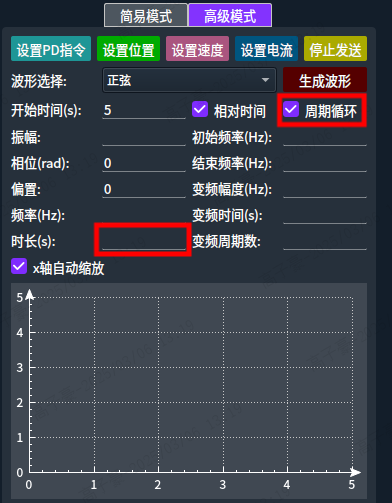  
## V0.0.1.7更新功能点
1. 运动界面增加暂停及时间轴缩放功能  
在勾选了波形暂停的情况下，右侧波形显示不会跟着最新的时间显示，同时可以使用鼠标滚轮和拖动来调整显示区域的大小和位置。  

2. 串联界面新增版本校验功能  
在串联界面中增加版本校验的按钮，按下后会对当前页面中的所有ip进行通讯版本和驱动版本检查（当两个版本均一致的情况下表示当前ip检查通过，否则表示不通过），会有三个颜色显示版本检查结果。绿色表示当前ip执行器的版本检查通过，黄色表示当前ip不存在，红色表示当前ip执行器版本检查未通过。  

3. 升级时新增增加二次确认升级界面，升级时新增版本匹配  
在按下任意通讯或驱动的升级按钮，都会弹出二次升级的提示框，会提示当前升级后的版本，并且在v1版本升级到v2时，限制只能升级通讯固件，在v2版本变更到v1版本时，限制只能变更驱动固件。
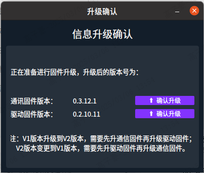
## V0.0.1.16更新功能点
1. 更新执行器设备图标  

2. 增加获取foc目标位置、速度、电流的功能  
在监控界面中，通过添加波形，并将属性修改为执行位置、执行速度、执行电流，即可观察对应数据。
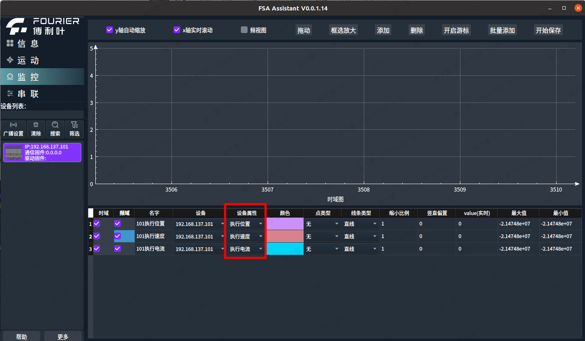
3. 添加整机自检功能  
在串联界面增加整机自检的按钮，整机自检功能主要用于检查当前机型的执行器版本是否正常（版本检查），执行器是否缺少（ip检查），执行器配置是否正确（执行器配置检查），执行器装配是否正确（执行器装配准确性检查）。

检查顺序为机型选择->ip检查->版本检查->执行器配置检查->执行器装配准确性检查。且每项检查之间互不影响。  
机型选择：目前支持检查的机型为GR1-T2和GR2-T5。  
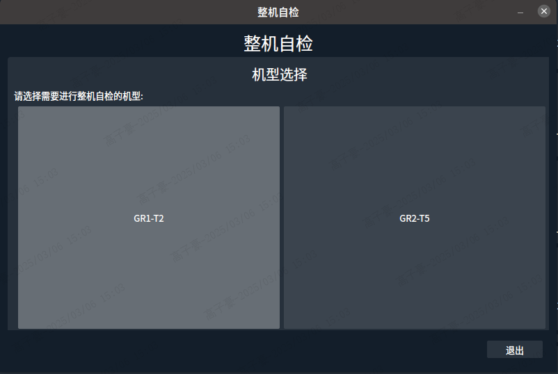  
ip检查：检查当前机型所有ip对应的执行器是否存在。（注意：使用前需要再点击导航栏下方的搜索按钮）  
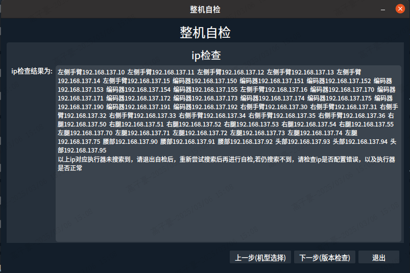  
版本检查：会检查该机型中所有存在的执行器的版本是否和输入的版本相符，不相符则提示出来。  
  
执行器配置检查：会对该机型中所有存在的执行器的配置进行检查，执行器配置不正常的则会提示出来。  
  
执行器装配准确性检查：会按照选择的区域对区域中的所有存在的ip,进行检查，检查流程为设置正转10度、反转10度并检查是否到位。（检查流程中的每一步都需要点击下一步）
  
4. 添加对于重复ip的检测  
在搜索时，如果搜索到两个执行器ip一样，则会进行提示。
  
5. 增加监控页面中批量添加波形的功能  
在监控界面中点击批量添加按钮后，弹出所有可以添加的属性，可以使用双击ip全选当前ip的所有属性，也可以双击对应属性，选择完后点击ok,既可将所有勾选的波形添加进去。（错误码勾选添加用于保存csv功能）  
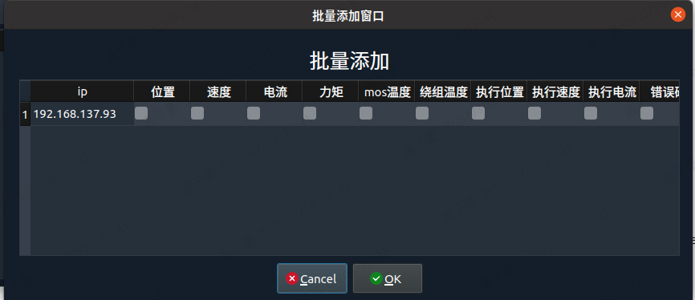  
6. 增加保存csv的功能  
在监控界面点击开始保存按钮，开始将下方表格中所有波形数据进行保存，（包括通过批量添加的错误码），同时会将数据保存到wave_data文件夹中。再点击结束保存，会弹出保存文件选择框并结束保存，默认保存文件路径为wave_data文件夹内。  
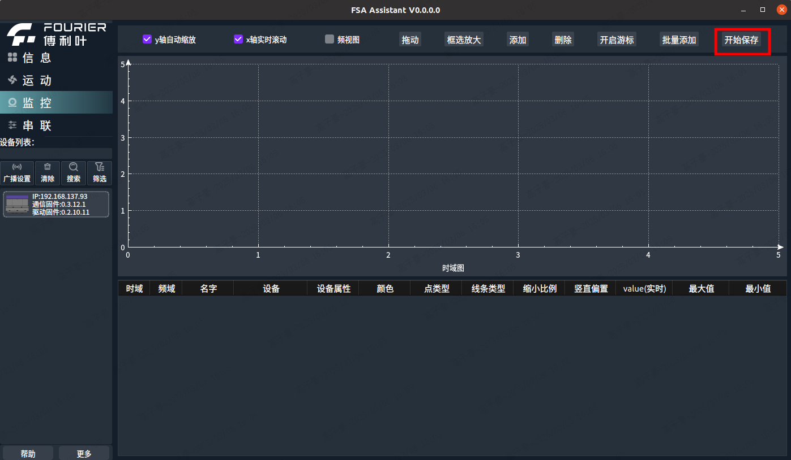   
7. 增加文件大小检测功能  
对于wave_data内的所有文件大小进行检测，在打开软件时如果超过1GB则会提醒用户。可以在更多中关闭和开启文件大小检测功能。
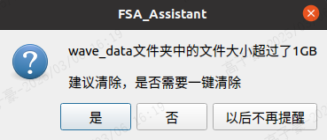   
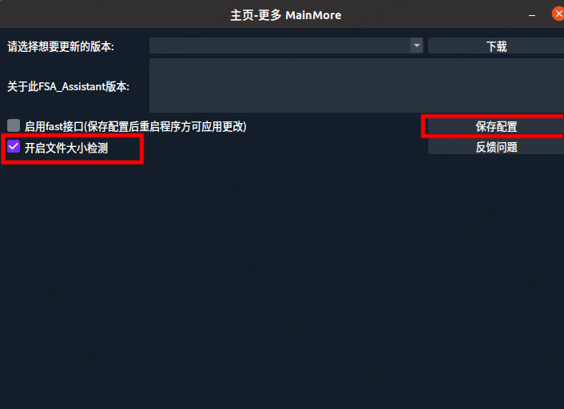   