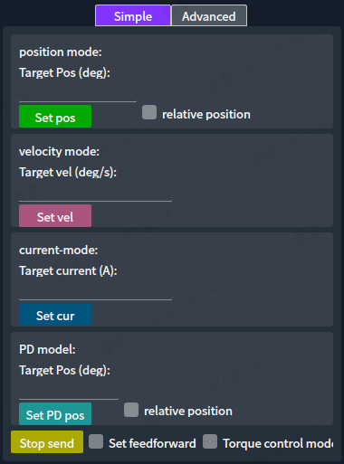

<header>

<!-- # FSA_Assistant Use the help tutorial -->

<!-- [中文(cn)](./README.md)      [英文(en)](./README_en.md)   -->
FSA_Assistant is an upper-level computer software that integrates comprehensive monitoring, control, data analysis and software upgrade functions. You can use FSA_Assistant to view information of the actuator, control its movement, monitor data, and upgrade the version, etc. It is mainly divided into a navigation bar and four sub-pages.

</header>

## 目录
[navigation bar](#navigation-bar)  
[Information page](#information-page)  
[Run Page](#run-page)  
[Monitoring page](#monitoring-page)  
[Series page](#series-page)  
[Common Function Usage Tutorial](#common-function-usage-tutorial)  
[Ubuntu Network Sharing Tutorial](#ubuntu-network-sharing-tutorial)  
[V0.0.1.3 Update function points](#v0013-update-function-points)  
[V0.0.1.7 Update function points](#v0017-update-function-points)  
[V0.0.1.16 Update function points](#v00116-update-function-points)  
## navigation bar
The navigation bar mainly realizes the search and selection of actuators as well as the switching between pages.

**The upper part of the navigation bar**，The main function is to achieve page switching. In the navigation bar, "Information", "Exercise", "Monitoring", and "Connection" are four different buttons,**When the button is clicked**, the corresponding sub-interface will be displayed in the right blank area. **When the button is double-clicked**, the corresponding sub-interface will be displayed in a separate window by itself. (The right blank area defaults to showing the information page.)

**The lower part of the navigation bar**，The main functions include displaying, searching, and clearing for the actuators. The "Broadcast Settings", "Clear", "Search", and "Filter" buttons in the navigation bar represent four different buttons. After pressing the search button, all connected actuators will be retrieved and displayed in the blank area below. When the clear button is pressed, all retrieved actuators will be deleted. When any retrieved actuator is pressed, the option of that actuator will be highlighted, indicating the selected state (the selected state is used in each sub-page).

   
  <em>Selected equipment status</em>

   
  <em>Device not selected state</em>

## Information page
The information page mainly displays the information of the selected actuators.

The monitoring interface is mainly divided into eight sections, among which 
- Region 1 is the **reboot area**, where the reboot device button can restart the selected actuator. Another reboot button can restart the software (the shortcut key Ctrl+R can also restart the software).
- Region 2 is the **upgrade area**, where you can perform communication and drive upgrades for the selected actuators. (For detailed upgrade procedures, please click [Common Function Usage Tutorial](#Common-Function-Usage-Tutorial))
-Region 3 is the **Equipment Information area**, which mainly displays the information of the selected actuator as well as error messages.
- Region 4 is the **identification area**.
- Region 5 is the **PID area**, where the PID parameters of the selected actuator can be retrieved and set.
- Region 6 is the **network area**, where the network parameters of the selected actuators can be retrieved and set.
- Region 7 is the **Actuator Configuration area**, where parameters for the selected actuator can be retrieved and set.
- Region 8 is the **debug information display area**. When the option to start UDP log is selected, the previously displayed debug information from the serial port will be shown in this area.
## Run Page
The run Page mainly enables the setting of speed, position and current for the selected actuator, as well as allowing the actuator to rotate according to the specified waveform and enabling the observation of the waveform data of a single actuator.

The Run Page is mainly divided into three parts, among which
- Region 1 is the **motor parameter setting area**. Here, you can select to observe the position, speed, current, torque, and temperature of the selected motor. When checked, these parameters will be displayed in Region 3. You can also set the enable/disable function of the motor and the calibration function. After pressing the reset chart button, all the charts in Region 3 will be cleared, meaning the data before pressing the button will no longer be displayed. You can also set the relevant parameters of the pid imm (the pid imm configuration takes effect immediately but is not saved. The parameters will be restored after restarting the actuator).
- Region 2 is the **waveform generation area**. It is mainly divided into two modes. One is the simple mode, where you can directly set fixed positions, speeds, and currents. The other is the advanced mode, which can generate various waveforms (sine, square, triangular, sawtooth, trapezoidal, linearly varying sine, time-varying sine, and periodically varying sine), and send these waveforms to the actuators according to position, speed, or current for execution.

   
  <em>Simple mode display</em>

   
  <em>Display of complex patterns</em>

Waveform Input Parameter Description: 

| name of parameter        | Parameter meaning    |
| --------    | -----   |
| start time        | When the "Relative Time" option is not selected, it becomes "Absolute Time", and the x-axis of the coordinate system in reference area 3 is used for filling. When the "Relative Time" option is selected, it indicates the time starting from the moment the waveform generation button is pressed.|
| amplitude        | For the maximum value of the waveform |
| phase position        | The phase of the waveform |
| polarization        | For a vertical offset, if it is positive, it will cause the waveform to shift upwards entirely. |
| frequency        | The frequency of the waveform |
| time        | The time required to generate the waveform, measured in seconds |
| original frequency        | The parameters required when generating linearly varying frequency sine waves, time-varying frequency sine waves, and periodic frequency sine waves are the initial frequency. |
| Ending frequency        | The parameters required for generating linear frequency-varying sine waves, time-varying sine waves, and period-varying sine waves are the final frequencies. |
| Frequency variation amplitude        | The parameters required when generating time-varying sine waves and frequency-varying sine waves are the amount of change in frequency each time. |
| Frequency variation time        | The parameters required for generating time-varying sinusoidal signals are: how often the frequency changes in each period, with the unit being seconds. |
| Frequency variation period        | The parameters required for generating a variable-frequency sine wave are that the frequency changes once every several cycles. |

-Region 3 is the **waveform display area**, where up to five parameters - the position, speed, current, torque, and temperature of the selected actuator - can be displayed simultaneously.
## Monitoring page
The monitoring page mainly monitors the data (position, speed, current, set position, set speed, set current, torque, MOS temperature, winding temperature) of all the actuators that have been retrieved.

The monitoring page is mainly divided into three parts, among which
- Region 1 is the **toolbar**, which contains numerous functions for viewing waveforms. When the y-axis automatic scaling option is selected, the y-axis range in the time-domain graph will be from the maximum to the minimum of the current display area. When the x-axis real-time scrolling option is selected, the x-axis will always display the latest data. When the frequency-domain graph is selected, the frequency-domain graph and frequency-domain information will be displayed in Region 2. After clicking the drag button, you can use the mouse to drag the time-domain graph or frequency-domain graph below to view the desired data. After clicking the box selection to zoom in, you can click and drag the time-domain graph or frequency-domain graph below to enlarge the corresponding coordinate system to the area selected by the mouse. Clicking "Add" will add a waveform data in Region 3. Clicking "Delete" will delete the selected waveform data in Region 3 and it will no longer be displayed in Region 2. You can select multiple waveforms by holding down the Ctrl key. After clicking, a waveform can be added or deleted. When the cursor is enabled, when the mouse is moved to the time-domain graph, the x and y-axis data of the current mouse position will be displayed, and the y-axis data corresponding to the mouse x-axis of this waveform will be displayed in the "Value" column in Region 3.
- Region 2 is the **waveform display area**. It is used to display time-domain graphs and frequency-domain graphs. The frequency-domain graph will only be displayed when the frequency-domain graph in Region 1 is selected. The frequency-domain information displayed in the frequency-domain graph corresponds to the corresponding frequency-domain information within the time-domain graph range. When the time-domain graph in Region 2 is right-clicked, a menu will pop up, allowing for automatic range adjustment once.
- Region 3 is the **area for setting and displaying waveform data**. After adding a waveform, it will not be immediately displayed in Region 2. You need to select the device and its attributes. Among them, the device refers to the IP of all actuators retrieved, and the device attributes include the position, speed, current, set position, set speed, set current, torque, MOS temperature, winding temperature of the actuator. You can select the attributes you want to observe. Other waveform data have default values and do not need to be set.

Explanation of the parameters that can be set for waveform data:
| name of parameter        | Parameter meaning    |
| --------    | -----   |
| time domain        | Editable attribute. When this option is selected, the time-domain information of this waveform will be displayed in the time-domain graph in Area 2. If you don't need to observe this waveform, simply uncheck it.|
| frequency domain        | Editable attribute. When this option is selected, the frequency domain information of this waveform will be displayed in the frequency domain graph in Area 2. If you don't need to observe this waveform, simply uncheck it. |
| name        | Non-editable attribute. The name of this waveform is determined jointly by the device and its attributes. |
| device        | Editable attribute, the actuator IP of this waveform |
| Device Properties        | Editable attribute, the observed actuator properties of this waveform (position, speed, current, set position, set speed, set current, torque, MOS temperature, winding temperature) |
| colour        | Editable attribute, used to select the color of this waveform. The default color is random. |
| vertex type        | Editable attribute, available options include: on/off, single point, cross, circle, star, triangle, square, rhombus, inverted triangle. |
| Line type        | Editable attributes include straight lines, left step size, right step size, middle step size, and pulse options. |
| reduce in scale        | The "editable" attribute will scale down the current y-axis data according to the input ratio, which is useful when observing multiple waveforms simultaneously and when the y-axis data have significant differences. |
| Vertical offset        | The "editable" attribute will display the current y-axis data after adding the input offset. |
| value        | Non-editable attribute. When the cursor function is not enabled, it displays the latest y-axis data. When the cursor is enabled, it shows the y-axis data of the waveform at the current x-axis position of the mouse. |
| maximum        | Non-editable attribute, the maximum value of this waveform |
| minimum        | Non-editable attribute, the minimum value of this waveform |
## Series page
The serial page is used to upgrade or set the speed of all or part of the actuators in humanoid robots, mechanical dogs, and centaurs.

The serial interface is mainly divided into four areas, namely:
- Region 1, the **Machine Type Selection Area**, is mainly used for selecting humanoid robots, mechanical dogs, and centaurs. Among the humanoid robots, there are two different types: T1/T2 and T4. By clicking on the corresponding area with the mouse, you can select the corresponding category. After selection, all the actuator IPs of the robots in that category will be displayed in Region 2.
- Region 2 is the **Robot IP Selection Area**. By checking the boxes corresponding to the IPs, you can set those IPs as selected (the selected state is used in regions 3 and 4). By checking the first box in the corresponding area, you can quickly select all the IPs in that area. For example, when checking the box on the left side of the left arm, all IPs from 192.168.137.10 to 192.168.137.17 will be selected.
- Region 3 is the **upgrade area**, which can be used to perform communication or drive upgrades for all selected actuators in Region 2. There are four different versions: production version, test version, development version, and cloud version. If the required version is not available, you can enter the desired version number in the Custom Version Number column and then click on Custom Upgrade to upgrade to the entered version number. (Note: The custom version number does not currently have an error detection function. Please check the input version yourself to ensure it is correct.)
- Region 4 is the **motion control area**, where the speed settings for multiple actuators can be made. On the horizontal line to the right of Velocity (degrees/second), enter the speed to be set (it is recommended to click the disable button before setting the speed to prevent the motor from suddenly rotating when selected). Then, click the enable button to make the selected motor rotate, and click the disable button to stop the selected motor. When this function is not in use, it is recommended to set the speed to 0.

## Common Function Usage Tutorial
 - Upgrade of a single actuator:   
  Before upgrading, please make sure to **modify the gateway of the device to be upgraded to the IP address of the wired network card of the current computer**. 
  - The tutorial for modifying the gateway of the actuator is as follows:  
  Search (find all actuators) -> Select the actuators that need to be upgraded -> Switch to the information page -> Modify the gateway -> Click Settings -> Click Obtain and check if the current gateway has been modified successfully -> Click Restart Device (to make the modified gateway take effect).
    
  
  Make sure to upgrade the communication firmware first, then upgrade the driver firmware! Ensure that Ubuntu/Windows can access the internet and that network sharing is enabled!

  Search (find all actuators) -> Select the actuators that need to be upgraded -> Switch to the information page -> Upgrade communication (choose one from the production version, test version, development version, cloud version, or a custom version) -> Upgrade driver (choose one from the production version, test version, development version, cloud version, or a custom version) -> Upgrade successful.
    

  - Multiple actuator upgrades:    
  Before upgrading, please make sure to **modify the gateway of the device to be upgraded to the IP address of the wired network card of the current computer**.  
- The tutorial for modifying the gateway of the actuator is as follows:  
  Search (find all actuators) -> Select the actuators that need to be upgraded -> Switch to the information page -> Modify the gateway -> Click Settings -> Click Obtain and check if the current gateway has been modified successfully -> Click Restart Device (to make the modified gateway take effect).
    
  
  Make sure to upgrade the communication firmware first, then upgrade the driver firmware! Ensure that Ubuntu/Windows can access the internet and that network sharing is enabled!

  Search (find all actuators) -> Switch to the series page -> Select the required machine type -> Select the actuators to be upgraded -> Upgrade communication (choose one from the production version, test version, development version, cloud, or custom version) -> Upgrade driver (choose one from the production version, test version, development version, cloud, or custom version) -> Upgrade successful.
  

 - View the waveform data of a single actuator:     
  Search (find all actuators) -> Switch to the monitoring page -> Select the required actuator from the device list -> Choose the attribute to observe -> Start observing.  
  

- View the waveform data of multiple actuators:  
  Search (find all actuators) -> Switch to the motion page -> Click the add button -> Select the device -> Select the device properties -> Continuously click the add button until all the required waveforms have been added -> Observe the waveforms (if you need to observe the frequency view, just check the frequency view option). 
  

- View the waveform data of multiple actuators to adjust the observation range  
  The initial steps are the same as those for viewing the waveforms of multiple actuators. After adding the waveforms -> cancel the real-time scrolling of the x-axis -> cancel the automatic zooming of the y-axis -> click and drag -> hold the mouse and drag in the time-domain or frequency-domain graph to adjust the observation range (or use the mouse scroll wheel to zoom in the observation range)  
    

- Adjust the size of the table in the monitoring interface。  
  Place the mouse cursor between the table header and the first row (it is recommended not to do this in the columns such as "Device", "Device Properties", "Color", "Point Type", "Line Type", as it is easy to accidentally touch). When an up-down directional arrow appears, it indicates success -> Hold down the mouse and drag it upwards to make the table larger, and drag it downwards to make the table smaller.
  

- Delete some waveforms in the monitoring interface。  
  Use the mouse to click on the reduction ratio or vertical offset of the row that needs to be deleted (if you need to delete multiple waveforms, you can use Ctrl + mouse click). (If you need to delete all of them, simply click on the header of the reduction ratio or vertical offset to select all of them)-> Click "Delete" to delete the selected waveforms.
  

- The use of the cursor function in the monitoring interface。  
  

- Set the execution of a single actuator for complex waveforms:。  
  Search (find all actuators) -> Switch to the motion page -> Select the required actuator from the device list -> Click on the advanced mode -> Choose the desired waveform -> Set the required waveform data -> Click on generate waveform -> Click on one of the three buttons for setting speed, setting position, and setting current as needed -> The motor starts to rotate -> When you need to stop, click the stop sending button.
  

- Set the speeds of multiple actuators:。  
  Search (find all actuators) -> Switch to the series page -> Select the required machine type -> Select the actuators to be upgraded -> Click the disable button (to prevent the motor from suddenly moving) -> Enter the speed -> Click the set speed button -> Click the enable button -> The motor starts to rotate -> When it needs to stop, click the disable button.
  

## Ubuntu Network Sharing Tutorial
### The first use
The local network needs to be configured to allow forwarding.
1. Open the terminal (right-click on the desktop, then select "Open in Terminal (E)")
2. Enter "sudo gedit /etc/sysctl.conf" and then enter the password (the password you input will not be displayed during the input process).
3. Find "net.ipv4.ip_forward=1" inside. Remove the "#" symbol in front of it or add "net.ipv4.ip_forward=1" at the end of the line. Then close this page.

4. Enter "ifconfig" in the terminal.
5. Find the name of the network card that can access the internet from the displayed information and remember it.

6. Locate the script's directory and open it: In the directory where the FSA_Assistant software is located, find a script named network_sharing_ubuntu.sh, right-click on it, and select "Open with Text Editor".
7. Replace the "wlp4s0" in the third line with your own wireless network card that can access the internet (wireless network cards usually start with "wl").

### everyday use
1. Locate the script directory: Find a script named "network_sharing_ubuntu.sh" in the directory where the FSA_Assistant software is located.
2. Open the terminal: Right-click in this directory and select "Open in Terminal" (E) to locate the script directory. Find the network_sharing_ubuntu.sh script in the directory where the FSA_Assistant software is located.
3. Enter the following in the terminal: sudo chmod 777 ./network_sharing_ubuntu.sh
4. Enter "./network_sharing_ubuntu.sh" in the terminal.
### Error correction report
Error correction: If you encounter the error message "sudo: unable to execute ./network_sharing_ubuntu.sh: No such file or directory", please try running the command again.  
The possible reason could be: The script file uses Windows' line feed characters (CRLF), instead of Unix/Linux's line feed characters (LF).  
The solution is: `vim network_sharing_ubuntu.sh` : `set fileformat=unix` : `wq`
After the operation, it is necessary to change `sudo iptables -P F` to `sudo iptables -P FORWARD ACCEPT`. The reason for this might be that the script file uses Windows line endings (CRLF) instead of Unix/Linux line endings (LF).
## V0.0.1.3 Update function points
1. Newly added navigation bar button highlighting  
When the current page is displayed, the corresponding navigation bar will be highlighted. Moreover, by double-clicking, the navigation bar can simultaneously display the contents of multiple navigation bars.  
  
2. Add detailed information of the run interface chart  
In the middle section of the run interface, the latest actual values of the current waveform graph, the target value data, as well as the average, maximum and minimum values of all current data will be displayed.  
  
3. Added automatic cursor function for the movement interface charts  
Place the mouse on the waveform graph of the motion interface, and it will display the system time received by this data at the current mouse position, the relative time compared to the program startup, as well as the received actual value and the sent target value at the current time.  
4. Added the function of exporting PDF files of the movement interface charts and pictures  
Clicking the "Export PDF" button will bring up a file saving interface. Select the path where you want to save the file and the name of the new file, and then it can be saved in the corresponding location.  
  
5. After enabling the cycle function, there is no need to fill in the duration anymore. The single-cycle waveform function will be automatically generated.  
In the advanced mode of the motion interface, if the "cycle" option is selected and the duration is not filled in or is set to 0, when generating the waveform, a periodic waveform will be automatically generated and executed in a loop.
  
## V0.0.1.7 Update function points  
1. The movement interface has added the functions of pausing and time-axis zooming.   
When the waveform pause option is selected, the waveform display on the right will not update with the latest time. At the same time, you can use the mouse scroll wheel and dragging to adjust the size and position of the display area.  

2. Added version verification function to the serial interface  
Add a button for version verification in the serial interface. When pressed, it will perform communication version and driver version checks for all IPs on the current page (if the two versions are the same, it indicates that the current IP has passed the check; otherwise, it indicates that it has failed). Three colors will be used to display the results of the version check. Green indicates that the current IP's version check has passed, yellow indicates that the current IP does not exist, and red indicates that the version check of the current IP's executor has failed.  

3. During the upgrade process, a secondary confirmation interface for the upgrade has been added, and version matching has also been implemented during the upgrade process.  
When the upgrade button for any communication or driver is pressed, a secondary upgrade prompt box will pop up, which will display the current upgraded version. When upgrading from version v1 to v2, it is restricted to only upgrading the communication firmware. When changing from version v2 to v1, it is restricted to only changing the driver firmware.

## V0.0.1.16 Update function points
1. Update the icon of the actuator device  

2. Add the functions of obtaining the target position, speed and current of the foc.  
In the monitoring interface, by adding waveforms and modifying the attributes to "execution position", "execution speed", and "execution current", the corresponding data can be observed.

3. Add the function of self-checking the entire machine  
Add a button for the overall machine self-check in the serial interface. The overall machine self-check function is mainly used to check whether the actuator version of the current model is normal (version check), whether the actuator is missing (IP check), whether the actuator configuration is correct (actuator configuration check), and whether the actuator assembly is correct (actuator assembly accuracy check).  
  
The inspection sequence is as follows: model selection -> IP check -> version check -> actuator configuration check -> actuator assembly accuracy check. And each inspection is independent of the others.  
Model selection: Currently, the models that are supported for inspection are GR1-T2 and GR2-T5.  
  
IP check: Verify whether the actuators corresponding to all IPs of the current model exist. (Note: Before using, please click the search button at the bottom of the navigation bar again.)
  
Version check: It will verify whether the versions of all the actuators present in this model are consistent with the input version. If they are not consistent, it will display a prompt.  
  
Actuator configuration check: This will check the configuration of all the existing actuators in this model. If the actuator configuration is abnormal, it will be displayed.   
  
Assembly accuracy check of the actuator: All existing IPs in the selected area will be inspected. The inspection process is to set the forward rotation at 10 degrees, reverse rotation at 10 degrees, and check if it is in place. (Each step in the inspection process needs to be clicked to proceed.)  
  
4. Add detection for duplicate IPs  
During the search process, if two actuators have the same IP address, a prompt will be given.
  
5. Add the function of batch adding waveforms to the monitoring page  
After clicking the "Batch Add" button in the monitoring interface, all the available attributes that can be added will be displayed. You can select all attributes of the current IP by double-clicking on the IP, or by double-clicking on the corresponding attribute and then clicking "OK", after which all the selected waveforms can be added. (Error code selection for addition is used for saving the CSV function)  
  
6. Add the function of saving CSV files  
Add the function of saving CSV. On the monitoring interface, click the "Start Saving" button to start saving all waveform data in the table below (including the error codes added in batches), and the data will be saved to the "wave_data" folder at the same time. Then click "End Saving", a file selection box for saving will pop up and the saving process will be completed. The default save file path is the "wave_data" folder.  
   
7. Add file size detection function  
All the file sizes within the "wave_data" directory are checked. When the software is opened, if the size exceeds 1GB, a prompt will be given to the user. The file size detection function can be turned on or off in the "More" section.  
   
   